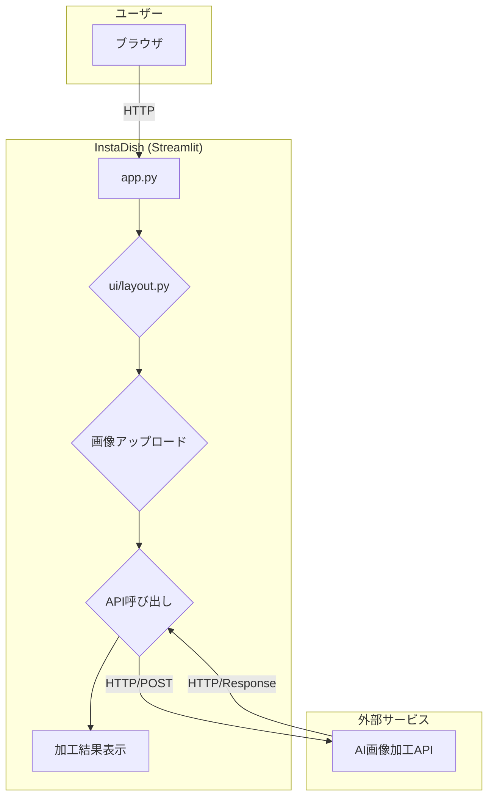

# InstaDish アーキテクチャ

このドキュメントは、InstaDishアプリケーションの技術的なアーキテクチャについて説明します。

## 概要

InstaDishは、ユーザーがアップロードした写真を自動で「インスタ映え」するように補正するWebアプリケーションです。フロントエンドはStreamlitで構築されており、実際の画像処理は外部のAI APIサービスを利用して行います。

## アーキテクチャ図

## コンポーネント

### 1. フロントエンド (UI)

- **フレームワーク**: Streamlit
- **ファイル**: `app.py`, `ui/layout.py`, `theme.css`
- **役割**:
    - アプリケーションのエントリーポイント (`app.py`)。
    - ユーザーインターフェースの構築 (`ui/layout.py`)。画像のアップロードフォームや、加工結果の表示領域を提供します。
    - アプリケーション全体のスタイル定義 (`theme.css`)。

### 2. バックエンドロジック

- **ファイル**: `ui/layout.py`
- **役割**:
    - アップロードされた画像データを受け取ります。
    - 外部のAI画像加工APIを呼び出し、画像データを送信します。
    - APIから返却された加工済み画像と説明文を受け取り、フロントエンドに渡して表示させます。

### 3. 画像処理エンジン

- **サービス**: 外部のAI画像加工API
- **エンドポイント**: `https://your-api-endpoint.com/process-image` (仮)
- **役割**:
    - POSTされた画像を受け取ります。
    - AIモデルを用いて、構図や色彩などを自動で補正します。
    - 加工済みの画像と、加工内容の説明を返します。

### 4. 未使用のコンポーネント

- **ファイル**: `processor/image_edit.py`
- **説明**: ローカルでの画像処理を実装するためのファイルと思われますが、現在のバージョンでは使用されていません。

## 依存ライブラリ

- `streamlit`: Webアプリケーションフレームワーク
- `requests`: 外部APIとのHTTP通信用
- `Pillow`: 画像処理（主に表示用）

## 処理フロー

1.  ユーザーがブラウザでアプリケーションにアクセスします。
2.  Streamlitで構築されたUIが表示されます。
3.  ユーザーは画像ファイルをアップロードします。
4.  `ui/layout.py` が画像を受け取り、`requests`ライブラリを使って外部AI APIにPOSTします。
5.  外部APIが画像を処理し、加工済み画像と説明を返します。
6.  `ui/layout.py` がレスポンスを受け取り、加工後の画像を画面に表示します。
